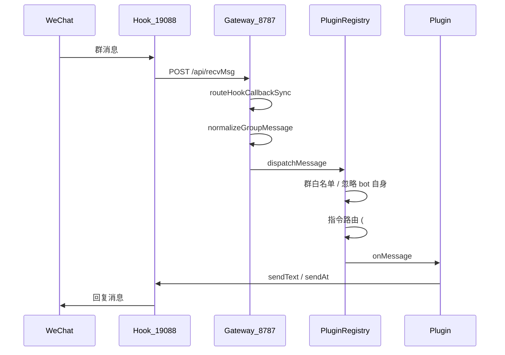

# 架构概览

## 分层架构

```
┌─────────────────────────────────────────────────────────┐
│  Hook 4.1.8.27（外部）                                    │
│  · 入站：POST /api/recvMsg 或 TCP 61108                   │
│  · 出站：POST http://127.0.0.1:19088/api/*               │
└───────────────────────┬─────────────────────────────────┘
                        │
┌───────────────────────▼─────────────────────────────────┐
│  apps/gateway                                           │
│  启动 BotEngine，监听 8787                               │
└───────────────────────┬─────────────────────────────────┘
                        │
┌───────────────────────▼─────────────────────────────────┐
│  packages/bot-core                                      │
│  · Webhook 接收（/api/recvMsg）                          │
│  · PluginRegistry 插件注册与分发                         │
│  · Command Router 指令路由                               │
│  · SqliteStorage 持久化                                  │
└───────────┬─────────────────────────────┬───────────────┘
            │                             │
┌───────────▼──────────┐    ┌─────────────▼───────────────┐
│ packages/hook-adapter│    │ plugins/*                   │
│ · 事件标准化          │    │ help / welcome / checkin …  │
│ · Hook4xAdapter 出站  │    │ 实现 BotPlugin 接口         │
└──────────────────────┘    └─────────────────────────────┘
            │
┌───────────▼──────────┐
│ packages/shared      │
│ 类型、IHookClient、   │
│ IStorage、BotPlugin  │
└──────────────────────┘
```

## 消息处理流程



## 模块职责

### `packages/shared`

定义跨层契约，**插件开发主要引用此包类型**：

- `BotPlugin` — 插件接口
- `PluginContext` — 运行时上下文
- `IHookClient` — 出站消息抽象
- `IStorage` — 数据持久化抽象
- `NormalizedMessage` — 标准化群消息

### `packages/hook-adapter`

- `Hook4xAdapter` — 封装 Hook REST（sendText、sendAt、kickMember、getGroupMembers）
- `normalizeGroupMessage` / `normalizeMemberJoin` / `normalizeMemberLeave` — 入站标准化
- `routeHookCallbackSync` — 统一回调 `/api/recvMsg` 事件分类
- `buildHook41827InjectConfig` — 生成 inject JSON

### `packages/bot-core`

- `BotEngine` — 组装配置、存储、Hook、插件，启动服务
- `PluginRegistry` — 扫描 `plugins/`，生命周期，指令冲突检测
- `createWebhookApp` — Hono 路由
- `TcpReceiver` — TCP 61108 模式（可选）
- `SqliteStorage` — SQLite 实现
- `SafeHookClient` — 发送失败只记日志，避免 webhook 500

### `plugins/*`

业务功能单元，每个插件独立目录，通过 manifest 注册。

### `apps/gateway`

薄启动层，读取 `config/bot.yaml`，创建 `BotEngine` 并 `start()`。

## 插件分发规则

1. `allowedRooms` 为空 → 处理所有群；非空 → 仅 listed roomId
2. `botWxid` 匹配发送者 → 忽略（防死循环）
3. 以 `commandPrefix`（默认 `#`）开头 → 走指令路由，按 `commands` 映射到插件
4. 否则按 `globalEnabled` / 群级 `enabledPlugins` 顺序调用各插件 `onMessage`
5. `onMessage` 返回 `true` → 停止后续插件

## 扩展点（后续迭代）

| 扩展点 | 位置 | 用途 |
|--------|------|------|
| 新 Hook 实现 | `hook-adapter/` 新增 `XxxAdapter implements IHookClient` | 切换 Hook 框架 |
| 新插件 | `plugins/<name>/` | 拆盲盒、砸金蛋、抽奖等 |
| 群配置 | `config/groups/<roomId>.yaml` | 按群开关插件、欢迎语 |
| LLM 接入 | 预留 `ILLMProvider`（待实现） | AI 陪聊 |
| 管理后台 | 待建 | Web 配置与数据看板 |

## 数据库表（SQLite）

| 表 | 用途 |
|----|------|
| `users` | wxid、昵称、积分 |
| `checkins` | 签到记录、连续天数 |
| `plugin_config` | 按群插件 JSON 配置 |
| `game_sessions` | 游戏状态机（拆盲盒等） |

详见 [存储 API](./storage-api.md)。
