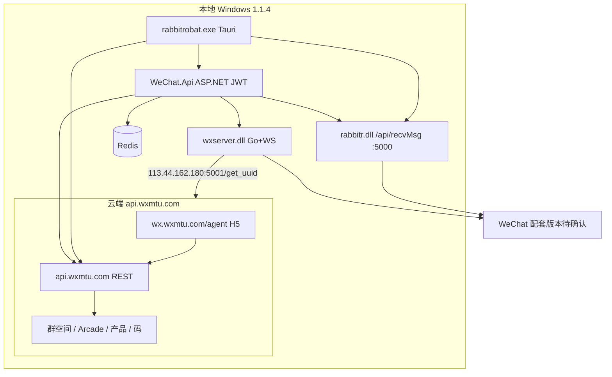
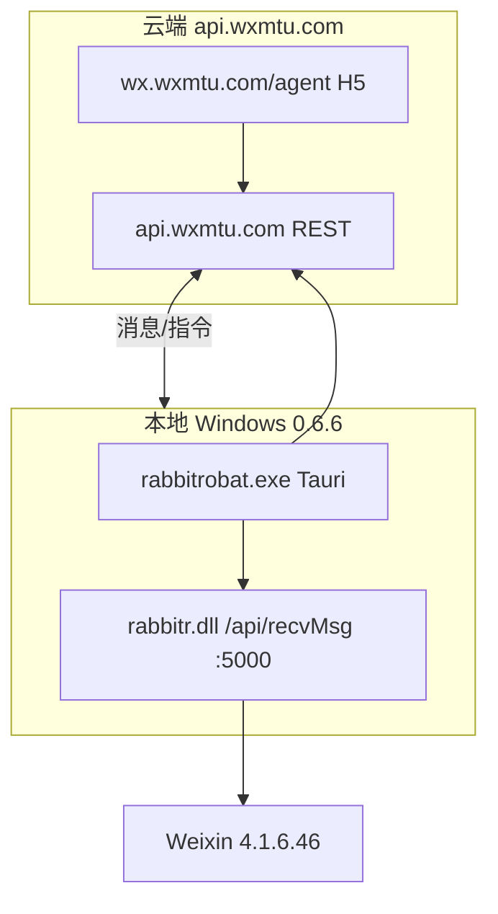

# 萌兔 MTRobot 本地端逆向分析（案例对照）

**分析日期：** 2026-06-25（**2026-06-25 二次勘误**：1.1.4 = 最新版；0.6.6 = 历史运行环境）  
**现行本地安装（2026-06-26）：** `D:\Mtrobot\` — **MTRobot 1.1.4**（完整重装，分析基线见 [mtrobot-data-merge-and-local-install-2026-06-26.md](./mtrobot-data-merge-and-local-install-2026-06-26.md)）  
**安装包/下载目录：** `D:\萌兔文件下载` — MTRobot 1.1.4  
**历史运行目录（曾用，非现行）：** `D:\萌兔机器人\解压在用` — MTRobot 0.6.6  
**云端后台：** [mtrobot-cloud-agent-recon.md](./mtrobot-cloud-agent-recon.md) — `https://wx.wxmtu.com/agent`

---

## 0. 勘误（重要）

| 此前误判 | 用户纠正 |
|----------|----------|
| 萌兔配套微信为 **3.9.12** | **`D:\萌兔文件下载` 里的 `WeChatSetup_3.9.12.51.exe` 是旧版放错**，不代表萌兔现行配套 |
| `VX强制低版本.exe` = 强制安装降版 | **`VX强过低版本.exe`**：让低版本微信登录时**不弹「版本过低」提示**，便于 Hook 配套版本正常使用 |
| **用户在跑 0.6.6**，1.1.4 只是下载包 | **1.1.4 才是最新版**；`D:\萌兔机器人\解压在用` 的 **0.6.6 是以前在用，不是现在** |
| 应以 0.6.6 运行目录为准做架构结论 | **应以 `D:\萌兔文件下载` 1.1.4 包为准**；0.6.6 仅作历史形态对照 |

**结论：** 萌兔现行产品形态 = **1.1.4 重本地栈**（Tauri + `rabbitr.dll` + `wxserver.dll` + `WeChat.Api` + Redis/SQLite）+ **云端 `api.wxmtu.com` / H5 总代**。0.6.6 是更薄的早期形态（仅 Tauri + `rabbitr.dll`），与小微 V 更接近。

---

## 1. 执行摘要（以 1.1.4 最新版为准）

萌兔 **1.1.4** 的形态：

> **Tauri 桌面壳 + Hook（`rabbitr.dll`）+ Go 协议服务（`wxserver.dll`）+ .NET REST 网关（`WeChat.Api`）+ 云端 `api.wxmtu.com`**

本地 **无** 娱乐插件目录；群玩法/总代管理在云端 H5。

| 对比项 | 小微 V | wechathook（现） | 萌兔 **1.1.4 最新版** |
|--------|--------|------------------|----------------------|
| 微信版本 | Weixin **4.1.6.46** | Weixin **4.1.8.27** | **待实机确认**（下载包内 3.9 安装包为误放；历史 0.6.6 曾用 4.1.6.46） |
| Hook/注入 | `libencode46.dll` | `libGLESv1.dll` | **`rabbitr.dll`**（HttpGateway，`/api/*`） |
| 本地应用层 | 几乎无（仅中继） | gateway + plugins | **WeChat.Api REST + wxserver 协议层** |
| 默认回调 | `:7788/api/recvMsg` | `:8787/api/recvMsg` | **`:5000/api/recvMsg`**（DLL 默认，可配置） |
| 本地 WS | — | — | `ws://localhost:2025/ws`，路由 `/rabbitr/*` |
| 云端 | Socket.IO `xvsvip.cn` | 规划中 | **`https://api.wxmtu.com/`** |
| 桌面壳 | Electron 9.3.1 | 无 | **Tauri（Rust）** `rabbitrobat.exe` |

**历史 0.6.6** 去掉 `wxserver` / `WeChat.Api`，形态更接近小微 V 薄中继 — 见 §2C。

---

## 2. 最新版目录结构（`D:\萌兔文件下载` 1.1.4）

```
D:\萌兔文件下载\
├── MTRobot_1.1.4_x64-setup.exe      # 安装包
├── MTRobot\
│   ├── rabbitrobat.exe              # Tauri 桌面主程序 (~24MB)
│   ├── system\
│   │   ├── rabbitr.dll              # Hook + 本地 HTTP 网关 (~8.6MB)
│   │   ├── wxserver.dll             # Go 协议/云端通信核心 (~53MB)
│   │   └── winwchat\                # 本地 WeChat API 服务
│   │       ├── WeChat.Api.exe       # ASP.NET Core 8 宿主
│   │       ├── WeChat.Core.dll      # 协议实现 (~16MB)
│   │       ├── redis\redis-server.exe
│   │       └── wwwroot\index.html   # 指向 Swagger
├── WeChatSetup_3.9.12.51.exe        # ⚠️ 误放/旧资料，非萌兔现行配套
├── MTDL\ MTU.exe                    # 代理/网络工具（拖微信图标、SOCKS）
├── VX强过低版本.exe                  # 登录时屏蔽「版本过低」提示（非降版安装器）
├── data.ini                         # 本地参数（退群间隔、缓存目录）
└── ipad环境安装\Redis-x64\           # 独立 Redis 安装包（环境依赖）
```

### 2.1 `rabbitrobat.exe` — Tauri 桌面壳

- **Tauri（Rust）**，非 Electron
- 连 `api.wxmtu.com` / `devapi.wxmtu.com`；协调本地 `rabbitr` / `WeChat.Api` / `wxserver`

### 2.2 `rabbitr.dll` — Hook + HttpGateway

- 默认 `http://127.0.0.1:5000/api/recvMsg`
- TCP `61108`（与 Hook 4.x / 小微 V inject 同族）
- `http_server.cpp`、`/api/send_voice`、`/api/get_profile_new` 等 — **Hook 风格 API**
- WebSocket：`/websocket`，`RecvWSUrl = ws://localhost:2025/ws`
- **勿与** wechathook 的 `libGLESv1.dll`（4.1.8.27）混 inject

### 2.3 `WeChat.Api.exe` + `WeChat.Core.dll`

**技术栈（来自 `WeChat.Api.deps.json`）：**

- .NET **8.0** / ASP.NET Core（inprocess IIS 模块）
- **Swagger**（`Swashbuckle.AspNetCore`）— 首页链接 `/swagger/index.html`
- **JWT Bearer** 鉴权（`Microsoft.AspNetCore.Authentication.JwtBearer`）
- **Redis**（`CSRedisCore`、`Caching.CSRedis`）
- **SQLite**（`Microsoft.Data.Sqlite`、`e_sqlite3.dll`）
- **SignalR**（deps 中含 `Microsoft.AspNetCore.SignalR.*`）
- **NLog** 日志

**从 DLL 字符串反推的关键点：**

| 发现 | 含义 |
|------|------|
| `ValidateMTRobotClientRequest` | 本地 API 校验「萌兔客户端」身份（JWT/密钥），非完全开放 localhost |
| 路由模板 `api/[controller]` | 标准 REST Controller 结构 |
| 大量 `WX*` 方法名 | 本地封装微信协议能力，而非 Hook 4.x 的 `/api/send_text_msg` 命名 |

**部分 `WX*` 能力（节选）：**

```
WXHeartBeat, WXGetProfile, WXGetLoginToken, WXGetContactLabelList
WXSendImageByCDN, WXSendVideoByCDN, WXSendVoice, WXSendHDImageByCDN
WXVerifyUser, WXBatchVerifyUser, WXGetChatroomAnnouncement, WXSetChatroomAnnouncement
WXTransferChatroomOwner, WXTenPay, WXGetPeopleNearby, WXSecReportClientCheck
WXMassMsg*, WXJSOperateWxData, WXShareFav, WXGetSafetyInfo ...
```

**结论：** 本地有一层 **「微信协议 SDK + REST 网关」**，供桌面壳和/或云端通过 JWT 调用；**不是**把 `#签到` 等业务写在本地。

### 2.4 `wxserver.dll`

- 体积 **53MB**，字符串含 **Go 标准库**、`gorilla/websocket`、`database/sql/mysql`
- 微信官方 URL（`mp.weixin.qq.com`、`channels.weixin.qq.com` 等）— **直接走协议层**
- **关键远程地址（字符串明文）：**
  ```
  http://113.44.162.180:5001/get_uuid
  ```
- WebSocket 相关：`Sec-WebSocket-Accept`、`*websocket.Conn`、`*websocket.Upgrader`
- 路由片段：`/LogOut`、`/applet`、`/friend`、`/finder`、`/qrcode/create/` 等

**结论：** `wxserver.dll` 是 **本地协议服务 + 云端会话/UUID 拉取** 的核心。

### 2.5 基础设施与辅助工具

| 组件 | 作用 |
|------|------|
| `redis-server.exe` | 本地状态/缓存（WeChat.Api 依赖） |
| `MTDL.exe` + `使用说明.txt` | 代理管理：拖微信图标、填 SOCKS |
| `MTU.exe` | 易语言编写的网络/代理辅助 |
| `WeChatSetup_3.9.12.51.exe` | 下载包内误放/旧资料，**非现行配套** |
| `VX强过低版本.exe` | **屏蔽登录「版本过低」提示**，非降版安装器 |
| `data.ini` | 本地参数（退群间隔、微信 Files 缓存目录等） |

---

## 2C. 历史形态（0.6.6，`D:\萌兔机器人\解压在用`，曾用非现行）

```
D:\萌兔机器人\解压在用\
├── MTRobot_0.6.6_x64-setup.exe
├── 微信4.1.6.46 64位新版.exe          # 当时配套微信
└── MTRobot\
    ├── rabbitrobat.exe
    └── system\
        └── rabbitr.dll                # 仅此 Hook 组件，无 wxserver / WeChat.Api
```

**与 1.1.4 差异：** 0.6.6 是 **薄客户端**（Tauri + Hook + 云端），更接近小微 V 路径 A；1.1.4 在本地增加了 **REST 协议层 + wxserver**，属于更重栈。

---

## 3. 推断的整体架构（1.1.4 最新版）



**与小微 V 的关键差异：**

| 小微 V | 萌兔 1.1.4 |
|--------|------------|
| 本地只做 `formatWechatMessage` + Socket 中继 | 本地有 **完整 REST 协议 API + wxserver** |
| 云端发 `cmd_message` 回本地执行 Hook | 云端可能调 **本地 WeChat.Api** 或 WS 到 wxserver |
| 无 Swagger、无 Redis | 有 **Swagger 自文档化 + Redis 状态层** |

---

## 3B. 历史架构（0.6.6，曾用）



---

## 4. 本地是否有「娱乐插件」？

**结论：安装包内没有。**

| 检查项 | 结果 |
|--------|------|
| `plugins/`、`games/` 目录 | 无 |
| asar/JS 业务脚本 | 无（非 Electron asar 结构） |
| 字符串：盲盒/签到/抽奖/游戏 | 未在本地 DLL 中发现 |
| 业务相关 | `WeChat.Api` 仅有 **WX 协议级** 方法 |

**娱乐与管理能力在云端后台**（H5 总代 + REST API）。1.1.4 本地比小微 V **多了能力 API 层**，但 **同样不在本地放玩法插件**。

---

## 5. 对 wechathook 演进的三条路径对照

### 路径 A — 小微 V / 萌兔 0.6.6 型（薄中继 + 云端）

```
Hook/rabbitr → 本地回调 recvMsg → 云端 api.wxmtu.com
云端 → H5 管理 + 娱乐 API（Arcade 等）
```

- **萌兔历史 0.6.6** 属于此型
- wechathook 上云可对标此路径（见 [cloud-relay-architecture.md](./cloud-relay-architecture.md)）

### 路径 B — 萌兔 1.1.4 型（重本地栈 + 云端，**现行产品**）

```
Hook + WeChat.Api(REST) + wxserver ↔ 云端 H5/API
```

- **1.1.4 下载包代表萌兔现行架构方向**
- wechathook 长期若需「本地协议 REST + 云端管理台」，可参考此型，但不必复制 53MB wxserver

### 路径 C — 当前 wechathook 型（本地全栈）

```
Hook → gateway 8787 → plugins 本地
```

- 开发最快，不适合多机与 SaaS 化

**建议：**

1. **短期**：继续路径 C 写插件原型  
2. **中期上云**：路径 A — `relay-client` + `bot-server`（对齐小微 V 协议，实现成本最低）  
3. **长期可选**：路径 A+B — 管理台参考萌兔 **`wx.wxmtu.com/agent` H5**；若需本地 REST 能力层再借鉴 1.1.4 的 `WeChat.Api` 思路，不必复制 wxserver  
4. **Hook 线**：wechathook 继续 **4.1.8.27 + libGLESv1**，与萌兔 `rabbitr` **不可混 inject**

---

## 6. 待云端权限 / 实机运行后核对清单

- [ ] 1.1.4 **实际安装目录**与配套 **微信版本**（下载包内 3.9 已确认为误放）
- [ ] 管理后台与本地 `WeChat.Api` / `wxserver` 的联调链
- [ ] 与 `113.44.162.180:5001` 的完整 API 列表
- [ ] 是否使用 SignalR Hub 推送
- [ ] 娱乐模块（盲盒/签到/群空间）是否纯云端配置
- [ ] 本地 `ValidateMTRobotClientRequest` 与云端 JWT 签发关系

---

## 7. 与现有文档的链接

- [云中继架构（wechathook 目标方案）](./cloud-relay-architecture.md)
- [萌兔总代后台侦察](./mtrobot-cloud-agent-recon.md)
- [Hook 4.1.8.27 对接](../hook-4.1.8.27.md) — **与萌兔 rabbitr 路线不混用**

---

## 8. 分析限制说明

- 未运行 `rabbitrobat.exe` / `WeChat.Api.exe`，端口与 `appsettings` 可能运行时生成
- 1.1.4 配套微信版本待用户实机确认
- 云端后台未登录，业务模型为 **静态逆向推断**

---

**文档版本：** 0.3（1.1.4 = 最新版主参考；0.6.6 = 历史曾用；保留 3.9 误放 / VX强过低版本 勘误）
