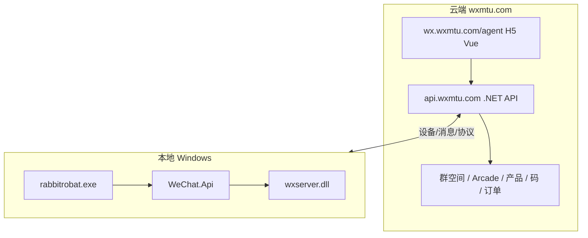

# 萌兔总代后台 — 云端 H5 侦察笔记

**分析日期：** 2026-06-25  
**入口 URL：** [https://wx.wxmtu.com/agent](https://wx.wxmtu.com/agent)  
**状态：** 页面可访问；用户授权账号开通中，登录后细节待补  
**关联本地分析：** [mtrobot-case-study.md](./mtrobot-case-study.md)

---

## 1. 前端形态

| 项 | 结论 |
|----|------|
| 类型 | **Vue SPA**（`#app` + 单包 `app.6cd809af.js`，~930KB） |
| 服务器 | **nginx/1.20.1** |
| 标题 | `h5`（移动端/H5 管理端） |
| 配置 | `static/config.js` 注入全局 `window.g.site` |
| 未登录 | 仅返回壳 HTML，业务路由由前端 `vue-router` 控制 |

**API 基址：** `https://api.wxmtu.com/api/`（`config.js` 的 `site` + 前端硬编码 `api`）

```javascript
window.g = {
  site: 'https://api.wxmtu.com/'
  // 历史注释: https://a.qingyu123.cn/
  //           http://47.103.223.5:7001/
}
```

**结论：** 总代后台是 **H5 前端 + 独立 API 域名**，与本地 `wxserver.dll` 里出现的 `113.44.162.180:5001` 可能为旧环境或设备通道，**管理业务主 API 为 `api.wxmtu.com`**。

---

## 2. 前端路由（总代 / 群 / 成员）

从 `app.6cd809af.js` 提取的 **vue-router** 路径（节选）：

### 代理（总代）侧

| 路由 | 推断功能 |
|------|----------|
| `/agent` | 总代首页 |
| `/agent-center` | 代理中心 |
| `/agent-center-account` | 账号管理 |
| `/agent-center-account-pc` | PC 端账号 |
| `/agent-center-account-ipad` | iPad 端账号 |
| `/agent-center-account-mac` | Mac 端账号 |
| `/agent-center-account-proxy` | 代理 IP 配置 |
| `/agent-center-group` | 代理下群管理 |
| `/agent-center-sever` | 服务器/实例（拼写 sever） |
| `/agent-codes-*` | 激活码：列表/入库/设置/产品/黑名单 |
| `/agent-buy` | 购买 |
| `/agent-template` | 模板 |
| `/agent-qr-code` | 二维码 |
| `/agent-model-list` | 模型/套餐列表 |

### 群 / 成员侧

| 路由 | 推断功能 |
|------|----------|
| `/group-center` | 群空间中心 |
| `/group-arcade-:groupId` | **群娱乐/街机**（按群 ID） |
| `/group-list-:op` | 群列表子页（积分/金币/红包/签到等） |
| `/group-display-:id` | 群展示配置 |
| `/group-resur-:id` | 群资源 |
| `/group-src-:op` | 群素材/指令源 |
| `/member-center` | 成员中心 |
| `/member-center-group` | 成员-群 |
| `/member-addGroup` | 加群 |

**与本地包对照：** 娱乐/群管理/代理/激活码 **全在云端 H5**，本地无对应插件目录 — 印证 [mtrobot-case-study.md §4](./mtrobot-case-study.md)。

---

## 3. 后端 API 模块（从 H5 包字符串反推）

基址：`https://api.wxmtu.com/` + PascalCase 控制器路径（.NET 风格）。

### 认证与代理

| API | 用途 |
|-----|------|
| `/Agent/login` | 总代登录 |
| `/Agent/index` | 代理首页数据 |
| `/Agent/menus` | 菜单权限 |
| `/Agent/srcGet` / `/Agent/srcPost` | 代理配置读写 |
| `/Login/loginGroup` | 群维度登录/切换 |
| `/Login/isLogin` | 登录态 |
| `/Login/captcha` | 验证码 |
| `/Account/loginStatus` | 账号状态 |
| `/Account/twiceLogin` | 二次验证 |

### 群与群空间

| API | 用途 |
|-----|------|
| `/Group/get` `/Group/selectGroup` | 群信息 |
| `/Group/openState` `/Group/setOpenStatus` | 群开关 |
| `/GroupCenter/get` `/GroupCenter/analysis` | 群空间数据/分析 |
| `/GroupCenter/getGroupMenu` | 群菜单（玩法入口） |
| `/GroupCenterSrc/*` | 群素材、按钮、同步、文件 |

### 娱乐与玩法

| API | 用途 |
|-----|------|
| `/Arcade/getList` `/Arcade/getTabs` | **街机/娱乐模块** |
| `/SuperBaby/getList` `/SuperBaby/spirit` `/SuperBaby/wish` | **超级宝贝类玩法** |

### 商业与码

| API | 用途 |
|-----|------|
| `/Product/*` | 产品、入口、黑名单、同步 |
| `/Codes/create` `/Codes/getList` | 激活码 |
| `/Order/createOrder` `/Order/checkOrder` | 订单 |
| `/Buy/getProduct` | 购买产品 |
| `/Template/getList` | 模板 |

### 设备与成员

| API | 用途 |
|-----|------|
| `/Member/ipad` | **iPad/协议端** 绑定 |
| `/Member/menu` `/Member/unBind` | 成员菜单、解绑 |
| `/Auth/getWxAuthUrl` | 微信授权 |

---

## 4. 架构关系（更新）



**与 wechathook 目标对照：**

| 萌兔 | wechathook 可借鉴 |
|------|-------------------|
| `api.wxmtu.com` 统一业务 API | 未来 `bot-server` |
| H5 总代/群管理 | 未来 Web 管理台（不必先做 Electron） |
| `/Arcade` `/SuperBaby` 云端玩法 | `plugins/` 部署在云端 |
| `/Member/ipad` 多端账号 | relay-client 多实例 + deviceToken |
| `/GroupCenterSrc` 群素材/按钮 | 类似插件配置 + 群级 `groups/*.yaml` |

---

## 5. 账号开通后建议验证项

- [ ] `/Agent/login` 请求体与 token 存储方式（Cookie / Header）
- [ ] `/Agent/menus` 返回的菜单树（对照 H5 路由）
- [ ] 群空间 `/GroupCenter/*` 与本地微信 wxid 绑定关系
- [ ] `/Arcade/getTabs` 返回结构（玩法如何挂到群）
- [ ] 本地 `rabbitrobat` 连的是 `api.wxmtu.com` 还是其他 WS 地址
- [ ] 与 `113.44.162.180:5001` 是否仍使用

---

## 6. 对 wechathook 方案的影响（暂不变更主路线）

1. **主路线仍为路径 A**（薄 relay + 云端 bot-server），萌兔证明 **H5 管理台 + REST API** 足够承载总代/群/娱乐。
2. **不必先做 Electron 桌面**；管理端可后期做 Vue H5，与 `wx.wxmtu.com/agent` 同类。
3. **插件/玩法命名空间**：可参考 `Arcade`、`GroupCenterSrc` 分「玩法引擎」与「群配置/素材」两层。
4. 开通账号后做一次 **Authenticated API 采样**，更新本文 §3 为确认版。

---

**文档版本：** 0.1（无登录态静态侦察）
