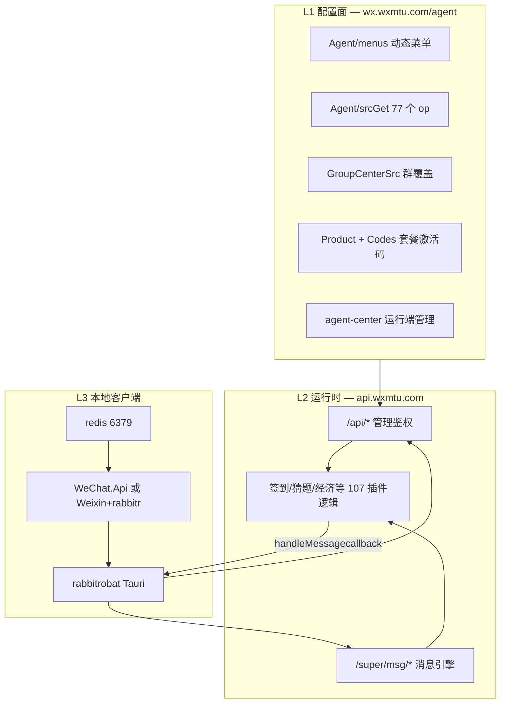

# 萌兔智能管家 — 综合架构与可复刻性分析报告

**日期：** 2026-06-26  
**数据来源：** 本机 live 日志、代理后台归档（`reference/mtrobot-agent-portal`）、桌面 mengtu 抓包、另一台 Win 模式登录报告  
**账号上下文：** 总代 `88888` / `uid=2157`；本机双号 `辞安.(longbiao079239)`、`难赴.(along523618)`

---

## 执行摘要

萌兔产品 = **三层 SaaS**：H5 配置面 + 云端运行时引擎 + 本地薄客户端（微信 I/O 中继）。

| 层级 | 可复刻性 | 更新/维护风险 |
|------|----------|---------------|
| 配置 schema（77 op + 107 插件 ID） | **高（~90%）** | 低，表单结构稳定 |
| 商业层（套餐/激活码/群授权） | **中高（~70%）** | 中，业务规则可自建 |
| 云端 `/super/*` 玩法引擎 | **低（~25%）** | 高，黑盒且随版本变 |
| 本地 Win 协议栈 | **低（闭源二进制）** | **高**，协议随微信变 |
| 本地 Inject Hook | **中（wechathook 可替代）** | **高**，PC 微信版本绑定 |
| 云端 PC/iPad/Mac 托管 | **低（需整套云基础设施）** | 中，与萌兔服务器耦合 |

**wechathook 对齐策略：** 复刻 **产品规格与配置模型**，用 **自建 bot-server + Hook gateway** 替换萌兔云端与 Win 协议栈；Inject 模式与 wechathook 技术路线最接近。

---

## 1. 三层架构（配置 / 运行 / 本地）



### 1.1 职责划分

| 平面 | 谁用 | 做什么 | 不负责什么 |
|------|------|--------|------------|
| **H5 总代后台** | 浏览器 | 写默认配置、插件开关、激活码、群覆盖 | 不处理实时群消息 |
| **云端 `/api/*`** | H5 + 客户端登录 | 鉴权、配置 CRUD、运行账号/服务器/IP 管理 | 同上 |
| **云端 `/super/*`** | **仅本地客户端** | callback 收消息、explis 群授权、lis 心跳、scu 同步 | 不在 H5 manifest 中 |
| **本地客户端** | 运营 PC | 登录微信、轮询消息、上报云端、执行发送指令 | 不含完整玩法逻辑（Win 模式已证实） |

---

## 2. 本地运行模式 taxonomy（重要：两套「模式」不要混）

萌兔语境里存在 **两套正交的「模式」概念**：

### 2.1 维度 A：`setting.json` → `kernelMode`（本机怎么连微信）

| kernelMode | 本地组件 | 是否需要 PC 微信 | 日志字段 | 本机状态 |
|------------|----------|------------------|----------|----------|
| **`win`** | `WeChat.Api.exe` + `redis` + `winwchat-runtime` | **否**（无头协议 3.9.12.51） | `client_mode: win`, `http_port: 8881` | ✅ 当前使用 |
| **`inject`** | `Weixin.exe` + `rabbitr.dll`（`D:\Mtrobot\system\`） | **是**（指定版本 PC 微信） | `kernel_mode: inject` | 本机曾失败（无匹配 Weixin） |

**`client_mode` 与 `kernel_mode`** 在 callback 里与 kernelMode 一致，表示上报云端时使用哪条 I/O 通道。

### 2.2 维度 B：H5「总代中心 → 账号管理」（云端托管的运行槽位）

| 后台路由 | API 族 | 含义 | 与本地客户端关系 |
|----------|--------|------|------------------|
| `/agent-center-account-pc` | `user.pc/*` | **云端 PC 协议实例**（扫码登录在云上） | 可与本地 win **并行**，是另一条线 |
| `/agent-center-account-ipad` | `user.auth/*`, `Member/ipad` | **云端 iPad 协议实例** | 非本机 iPad 模拟 |
| `/agent-center-account-mac` | `user.mac/*` | Mac 协议槽 | 同上 |
| `/agent-center-account-proxy` | `user.proxy/*` | **IP 代理池**（给上述云端实例挂 SOCKS/HTTP） | 本地 `proxyEnable` 是另一层 |
| `/agent-center-sever` | `sever/*` | **云服务器/VPS 实例** 开机关机重装 | 萌兔卖/租算力，非你家 PC |

**结论：** 你在客户端里切的「Win / Hook / PC」≈ **维度 A**；后台里的 Win 登录 / iPad 登录 ≈ **维度 B 云端槽位**。本地 Win 模式 **不需要** 配置 `sever` 或 `user.pc`，除非要把号迁到云上跑。

### 2.3 安装目录对应关系

```
D:\Mtrobot\
├── rabbitrobat.exe          # Tauri 主控
└── system\
    ├── winwchat\            # Win 协议栈 → 复制到 AppData\...\winwchat-runtime
    ├── rabbitr.dll          # Inject 模式注入
    ├── wxserver.dll         # 云端/辅助协议（与 wxserver 目录配套）
    └── wxserver\assets\     # 证书等
```

---

## 3. 本机实测：签到闭环（2026-06-26 09:09）

已在授权群 `57226609398@chatroom` 验证 **云端算、本地发**：

```
1. 群成员「怪兽SHOP」发「签到」
2. WeChat.Api 双号均收到 event_type=2000 群聊消息
3. POST /super/msg/callback（acc_wxid 分别为辞安/难赴）
4. 云端返回 handleMessagecallback:
   { msg_type:1, acc_wxid:"along523618", content:"签到成功！奖励金币546..." }
5. 难赴号 POST /api/Message/WXSendMsg → 群聊回复
6. 再次 callback 上报发送结果
```

**要点：**

- 玩法执行在 **`/super/msg/callback` 响应**，不在本地插件引擎（修正早期「本地规则匹配」推断）。
- 回复账号是 **`along523618`（难赴.）**，与 explis 授权一致。
- `辞安.` 同群也能收到消息并 callback，但无独立授权时不应产生业务回复（本次回复走难赴号）。

### 3.1 群授权 explis（复习）

| 账号 | wxid | explis | 主授权群 |
|------|------|--------|----------|
| 辞安. | longbiao079239 | status=0 `not dat`（20 群） | 无 |
| 难赴. | along523618 | status=1 `suc`（6 群） | `57226609398@chatroom` expires 明显更长 |

授权绑定的是 **群 wxid + 总代 uid**，不是「微信号有没有扫后台」这么简单。

---

## 4. 同步配置 scu：你点了仍失败

| 时间 | 场景 | 结果 |
|------|------|------|
| 08:08–08:32 | 登录前 | `syncConfig` → `error is exist` |
| **09:10:22** | **登录后、签到成功后手动点同步** | **仍 `error is exist`** |

**推断（待萌兔侧或抓包确认）：**

1. `error is exist` 可能表示「同步任务已在队列/无需重复」而非真失败；
2. 或总代账号 **`2157` 的 scu 权限/套餐** 未开通；
3. 或配置已通过 **callback 热路径** 下发，scu 只是冷启动全量快照（非必需）。

**业务上：** 签到能成功说明 **运行时配置已生效**；scu 失败不阻塞玩法。

---

## 5. 代理后台：激活码查不到 & 没有「下级团队」

### 5.1 激活码列表为空的原因

归档 `Codes/getList` 样本：

```json
{ "total": 9, "list": [] }
```

**total=9 但 list 空** — 说明后台 **有 9 条码记录**，但当前 API 参数/分页/状态筛选下 **未返回列表**。常见原因：

| 可能 | 说明 |
|------|------|
| **状态 Tab** | 页面分「未使用 / 已激活 / 已过期」，需切换 |
| **分页** | 脚本只拉了第一页空页 |
| **激活路径不同** | 在 **`/codes-center`（用户激活中心）** 或 **客户端内输入** 激活，消费后从「未使用」列表移除 |
| **绑定在群上** | explis 只暴露 `expires`，H5 群详情里可能有码信息 |

你已激活且群有 expires → **云端授权库有记录**；H5 列表是 **管理视图**，可与运行时库不同步展示。

**建议你本地核对：**

1. H5 → **版本管理 → 激活码列表** → 切换「已激活 / 全部」  
2. **群组** → 打开 `57226609398` 对应群 → 看是否显示套餐/到期  
3. **`/codes-center`**（若从群链接进入）看个人激活记录  

### 5.2 没有「开通团队下级」入口

从 `Agent/menus` 全量菜单看，总代 H5 **只有四类**：

1. 基本配置（77 op 里的群管/签到等）  
2. 模板管理  
3. 版本管理（激活码相关）  
4. 娱乐功能  

**没有**「发展下级代理 / 团队树 / 分润」菜单项。

萌兔账号体系（路由级）：

| 入口 | 路由 | 角色 |
|------|------|------|
| 总代后台 | `/agent` → `/agent-center` | 你现在的 `88888` |
| 成员/个人后台 | `/member-center` | 群用户、激活码用户 |
| 激活码中心 | `/codes-center` | 输入码、绑群 |
| 购买 | `/agent-buy` | 套餐购买 |

**结论：** 你的账号是 **总代（顶层）**，不是「大总代下的子代理」。更低级别的 **多级分销** 要么未对该 uid 开放，要么在萌兔商业体系外单独签约。这不是你「没找到」，而是 **产品菜单里就没有团队下级**。

### 5.3 后台几项困惑对照表

| 你的困惑 | 实际含义 | 本地 Win 模式是否要配 |
|----------|----------|------------------------|
| **添加 IP 代理** | `user.proxy/*`：给 **云端协议实例** 挂代理 IP（防封/地域） | 可选；`setting.json` 有 `proxyEnable` 本地代理 |
| **配置服务器** | `sever/*`：萌兔 **云 VPS** 生命周期（开/关/重装/链接） | **否**，本地跑 win 不用租 sever |
| **Win 登录** | `user.pc/*`：**云端 PC 协议位** 扫码 | **否**，与本地 `kernelMode:win` 不同产品 |
| **iPad 登录** | `user.auth/*`：**云端 iPad 协议位** | **否**，非本机模拟 iPad |

---

## 6. 云端运行时 API（客户端专用）

| 接口 | 作用 | 本机证据 |
|------|------|----------|
| `POST /super/msg/callback` | 消息/事件上报 + **收回复指令** | 签到全链路 |
| `POST /super/msg/explis` | 批量群授权校验 | 难赴 suc / 辞安 not dat |
| `POST /super/msg/lis` | 在线 wxid 注册心跳 | 双号 + wechatversion |
| `POST /super/msg/scu` | 配置全量同步 | 持续 `error is exist` |
| `POST /api/agent/inf` | 客户端登录总代 | 启动时 |
| `POST /api/dock/cloudy` | 线路/dock | 偶发 |

**handleMessagecallback 已知字段：**

```json
{
  "msg_type": 1,
  "acc_wxid": "along523618",
  "to_wxid": "57226609398@chatroom",
  "wxid": "57226609398@chatroom",
  "content": "签到成功！..."
}
```

本地映射 → `WeChat.Api` 的 `POST /api/Message/WXSendMsg`。

---

## 7. 各模式可复刻性 & 更新能力（wechathook 方向）

### 7.1 评分矩阵

| 模式/模块 | 复刻难度 | 自主更新能力 | wechathook 建议 |
|-----------|----------|--------------|-----------------|
| **H5 动态配置 77 op** | ⭐ 易 | ⭐⭐⭐ 完全自控 | 用 JSON Schema + admin 重写 |
| **107 插件 ID 目录** | ⭐ 易 | ⭐⭐⭐ | `PluginRegistry` manifest |
| **群覆盖 GroupCenterSrc** | ⭐⭐ 中 | ⭐⭐⭐ | SQLite/YAML per group |
| **Product/Codes/explis 授权** | ⭐⭐ 中 | ⭐⭐⭐ | 自建 billing + 群白名单 |
| **云端 `/super/*` 引擎** | ⭐⭐⭐⭐⭐ 极难 | ⭐ 依赖萌兔 | **自建 bot-server** |
| **本地 Win 协议栈** | ⭐⭐⭐⭐⭐ 极难 | ⭐ 等萌兔更新 | **不复刻**，用 Hook |
| **本地 Inject (rabbitr)** | ⭐⭐⭐ 难 | ⭐⭐ | **wechathook Hook4x 替代** |
| **云端 PC/iPad 托管** | ⭐⭐⭐⭐ 很难 | ⭐ | 后期 SaaS 再做 |
| **IP 代理池** | ⭐⭐ 中 | ⭐⭐⭐ | 接第三方代理 API |

### 7.2 更新风险详解

**微信侧版本 churn（最大风险）**

- Win 模式：`WeChat.Core.dll` 绑定协议版本（日志 `3.9.12.51`），微信改协议 → 萌兔发新版 `WeChat.Api`。
- Inject 模式：绑定 **具体 PC 微信 build**（如 4.1.8.x），升级微信 → 换 dll / 换 hook 偏移。
- wechathook：**选 Hook 路线 = 接受跟随 PC 微信版本**；选协议路线 = 接受逆向成本。

**萌兔云端 churn**

- 新插件 = 新 op + 新 plug id + 云端新逻辑（你 **看不到源码**）。
- `/super/*` 请求体随时可加字段；客户端 `rabbitrobat` 随 App 更新。

**配置层 churn（最低）**

- `Agent/srcGet` 表单字段十年相对稳定：`switch_checked`、`message`、`tag` 变量。
- 你归档的 77 op + 107 插件 **足够做规格基线**。

### 7.3 推荐技术路线（无限接近萌兔模式）

```
┌─────────────────────────────────────────────────────────┐
│  自建 admin（对齐 Agent/srcGet + GroupCenterSrc）         │
│  自建 bot-server（对齐 /super/msg/callback 语义）          │
│  自建 billing（对齐 Product/Codes/explis）                │
└───────────────────────────┬─────────────────────────────┘
                            │ HTTPS
┌───────────────────────────▼─────────────────────────────┐
│  wechathook gateway（薄 relay，对齐 rabbitrobat 职责）    │
│  Hook4xAdapter → 标准化 event → 上报 bot-server           │
│  ← 指令 sendText/sendAt → Hook 出站                       │
└───────────────────────────┬─────────────────────────────┘
                            │
                     原生 Weixin + Hook
```

**刻意不复刻：** 萌兔 `WeChat.Api` 闭源协议栈、萌兔云 VPS/iPad 托管（除非你要做同款 SaaS 卖槽位）。

---

## 8. 是否需要切换其他模式做分析？

| 模式 | 建议 | 理由 |
|------|------|------|
| **Win 协议（当前）** | ✅ **已完成核心分析** | 签到闭环、callback、explis 已证实 |
| **Inject Hook** | ⚠️ **可选 P1** | 与 wechathook 同路线；需装匹配版 Weixin、停 wechathook gateway 防冲突 |
| **云端 PC 登录** | 🔵 **P2 可选** | 需后台买槽位/服务器；弄清 `user.pc` 与本地 win 分工 |
| **云端 iPad** | 🔵 **P2 可选** | 同上；对 wechathook v1 非关键 |
| **Mac 协议** | ⬜ 跳过 | 非 Windows 主战场 |

**结论：** **不必为架构报告再切模式**；Win 已足够定义「薄客户端 + 胖云端」。若你要 **验证 Hook 路径与 wechathook 等价性**，再切 inject 做一次并行对比即可。

---

## 9. 物理配合清单（可选下一步）

1. **激活码列表**：在 H5 切「已激活」Tab 截图或告知是否有记录。  
2. **scu**：问萌兔客服 `error is exist` 含义，或抓包看 HTTP 200 body 完整结构。  
3. **Inject 模式（可选）**：安装萌兔要求的 Weixin 版本 → 改 `kernelMode: inject` → 登录单号 → 对比 callback 是否仍走 `/super/*`。  
4. **群空间配置**：H5 打开授权群 → 看 GroupCenterSrc 是否有覆盖项。  

---

## 10. 文档与数据索引

| 路径 | 内容 |
|------|------|
| `reference/mtrobot-agent-portal/FULL-ANALYSIS.md` | 77 op / 107 插件 / 商业层 |
| `reference/mtrobot-agent-portal/plugin-catalog.json` | 插件 ID 全量 |
| `C:\Users\along\Desktop\mengtu\mt\` | 页面 HTML + Agent_menus + API 样本 |
| `C:\Users\along\AppData\Local\com.admin.MTRobot\logs\MTRobot-2026-06-26.log` | 本机 live（含签到） |
| `C:\Users\along\Desktop\萌兔智能管家_登录流程分析报告.md` | Win 模式进程/端口（注意 §7 插件引擎应改为云端） |

---

## 11. 总结一句话

萌兔卖的是 **「配置 SaaS + 云端玩法 + 任意一种微信接入（本机协议 / 本机 Hook / 云端 PC/iPad）」**；你要 **无限接近这种模式**，应 **全量复刻配置与产品规格**，用 **wechathook + 自建 bot-server** 替换 **闭源协议栈与黑盒 `/super/*`**，而不是 fork 萌兔客户端。
