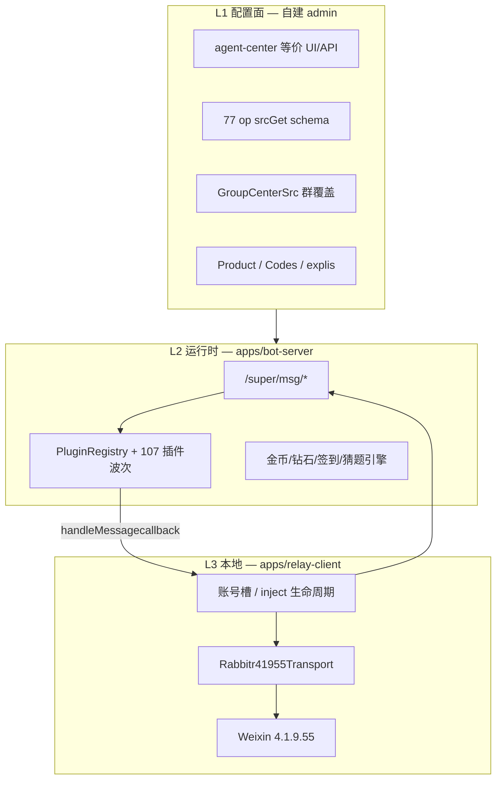
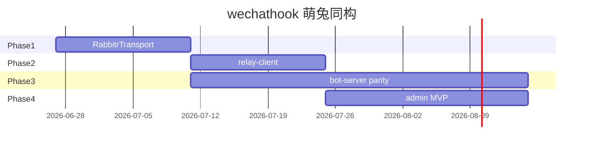

# wechathook × 萌兔同构 — 主开发路线图

**版本：** 1.0  
**日期：** 2026-06-26  
**状态：** 执行中（Phase 1 下一步）  
**北极星：** 无限接近萌兔产品形态 — **H5 配置 SaaS + 自建 `/super/*` 引擎 + 本地薄客户端（rabbitr inject 主路径）**

---

## 1. 战略决策（已拍板）

| 决策 | 选择 | 理由 |
|------|------|------|
| 是否 fork 萌兔源码 | **否** | 闭源；只复刻规格与语义 |
| 主传输层 | **rabbitr.dll + Weixin 4.1.9.55** | inject 已登录实测；`D:\Mtrobot\system\` 可持续更新 |
| 次传输层 | Win 协议 3.9.12.51 | 可选；需闭源 `WeChat.Api`，Phase 5+ |
| 废弃主路径 | libGLES 4.1.8.27 | 与萌兔版本线分叉；保留为 dev 对照即可 |
| 云端 | **自建 bot-server** | 对齐 `/super/msg/*`；不长期依赖萌兔云 |
| 本地壳 | **relay-client → 最终 Tauri 壳** | 对齐 `rabbitrobat` 职责；短期可桥接现有萌兔壳 |
| 配置 | **77 op JSON Schema + 群覆盖** | 已有 `reference/mtrobot-agent-portal` 全量归档 |

### 1.1 目标架构（终态）



### 1.2 inject 实测基线（2026-06-26）

| 字段 | inject 实测 | Win 对照 |
|------|-------------|----------|
| `kernel_mode` | `inject` | `win` |
| `client_mode` | `pc` | `win` |
| `http_port` | **19088** | 8881 |
| 出站发文本 | **`/r/stm`** `{t,c}` | `WXSendMsg` |
| 出站 SQL | **`/r/sqe`** `{db,sq}` | — |
| 云端 callback | `/super/msg/callback` | 相同 |
| `handleMessagecallback.msg_type` | 1/16/19/50… | 相同语义 |

归档位置：`reference/mtrobot-agent-portal/api-samples/inject-session-2026-06-26/`（待下一 agent 从日志抽取）

---

## 2. 当前进度快照

| 模块 | 完成度 | 说明 |
|------|--------|------|
| monorepo + gateway + 5 插件 | ✅ ~90% | `apps/gateway`、`plugins/*` |
| Hook4xAdapter (libGLES) | ✅ | 非主路径 |
| **bot-server v0** | ✅ ~40% | `/super/*` 四路由 + 签到引擎 |
| mengtu 规格归档 | ✅ ~85% | 77 op、107 插件、群空间 API |
| **Rabbitr41955Transport** | ⬜ 0% | **Phase 1 首要交付** |
| relay-client | ⬜ 0% | Phase 2 |
| plugin-config (77 op) | ⬜ 0% | Phase 3 |
| admin H5 | ⬜ 0% | Phase 4 |
| billing / explis 完整 | ⬜ ~15% | bot-server 群 yaml 原型 |

---

## 3. 分阶段路线

### Phase 0 — 基线冻结 ✅

- [x] monorepo、gateway、SQLite、PluginRegistry
- [x] 萌兔三层架构报告、inject/win 双模式日志
- [x] bot-server 骨架 + 群 `57226609398` 配置样例

**出口标准：** 文档 + 可运行 gateway/bot-server。

---

### Phase 1 — 传输层同构（2–3 周）◀ **当前**

**目标：** wechathook 能脱离萌兔云端，用 rabbitr 完成「收消息 → bot-server → 发消息」闭环。

| 任务 | 包/应用 | 交付物 |
|------|---------|--------|
| P1.1 `IWeChatTransport` 抽象 | `packages/transport` | 统一 login/sendText/onMessage |
| P1.2 `Rabbitr41955Adapter` | `packages/hook-adapter` 或 transport | `/r/stm`、`/r/sqe`、recvMsg 归一化 |
| P1.3 inject 规格归档 | `reference/.../inject-session/` | API 表、msg_type 矩阵、样例 JSON |
| P1.4 `inject-config` 4.1.9.55 | `packages/hook-adapter` | 指向 `D:\Mtrobot\system\rabbitr.dll` |
| P1.5 gateway 双模式 | `apps/gateway` | `transport: rabbitr \| hook41827` |
| P1.6 联调脚本 | `scripts/e2e-inject-sign.mjs` | 模拟 callback → bot-server → /r/stm |

**出口标准：** 在 **不启动萌兔客户端** 或 **萌兔仅作 inject 工具** 的前提下，授权群 `#签到` 或 `签到` 走 **自建 bot-server** 完整回复。

**刻意不做：** 逆向 rabbitr 内部；Win 协议栈。

---

### Phase 2 — 本地薄客户端（2–3 周）

**目标：** 替代 `rabbitrobat` 的「账号管理 + 上报/执行」职责。

| 任务 | 交付物 |
|------|--------|
| P2.1 `packages/relay-protocol` | Mengtu callback 编解码、handleMessagecallback 执行器 |
| P2.2 `apps/relay-client` | 多账号槽、lis 心跳、explis 拉群、callback 转发 |
| P2.3 API 路由切换 | `apiBase` 配置 / hosts 桥接 → 本地 bot-server |
| P2.4 桥接模式（过渡） | `mode: bridge-mengtu-shell` — 保留萌兔 inject，只换云端 |
| P2.5 配置 `relay.yaml` | dll 路径、微信路径、bot-server URL、tok/mac |

**出口标准：** 关掉萌兔官方云依赖；relay-client + bot-server 跑通难赴. 单号 + 授权群全套指令。

---

### Phase 3 — 云端引擎 parity（4–8 周，持续）

**目标：** bot-server 行为无限接近萌兔 `/super/*` 黑盒。

#### 3.1 协议 completeness

| msg_type | 含义 | 优先级 |
|----------|------|--------|
| 1 | 发文本 | P0 ✅ |
| 2 | 发图/URL | P1 |
| 16 | 远程 Hook 调用（sqe/stm 等） | P1 |
| 19 | 私聊/@ 成员 | P2 |
| 50 | 群列表同步 | P2 |

#### 3.2 配置驱动

| 任务 | 包 | 说明 |
|------|-----|------|
| P3.1 `packages/plugin-config` | 77 op → Zod/JSON Schema | 读 `Agent/srcGet` 归档 |
| P3.2 群覆盖合并 | bot-core | 默认 + `GroupCenterSrc` diff |
| P3.3 explis + 套餐 | bot-server | Product/Codes 语义；月卡 expires |
| P3.4 经济引擎 | bot-core | 金币/钻石/连续/排行榜 |

#### 3.3 插件波次（107 ID）

| Tier | 类型 | 示例 | 策略 |
|------|------|------|------|
| T1 | Content API | greentea/tgrj/weather/sentence | 薄插件 + 外部 HTTP |
| T2 | 猜题统一引擎 | guess* | 单一 GuessEngine + 多 op 配置 |
| T3 | 状态机 RPG | partner/fish/farms | 改 QQ bot 模块 |
| T4 | 群管 | welcome/menu/tube/kick | 复用现有 admin/welcome |

**出口标准：** 授权群启用 top-20 插件（按萌兔菜单热度排序）；签到/菜单/查有效期/一言 与萌兔输出格式 ≥90% 一致。

---

### Phase 4 — 配置面 / 商业层（3–5 周）

| 任务 | 说明 |
|------|------|
| P4.1 `apps/admin` | 总代后台 MVP：登录、插件开关、sign 表单 |
| P4.2 群空间等价 | entry hash + 密码 → GroupCenterSrc |
| P4.3 激活码 | Codes 生成/绑定/到期 |
| P4.4 运行账号管理 | 对齐 `user.pc` 槽位 UI（本地 inject 槽优先） |

**出口标准：** 不用萌兔 H5 也能配置签到/欢迎/群授权。

---

### Phase 5 — 可选扩展（按需）

| 模块 | 触发条件 |
|------|----------|
| WinProtocolAdapter | 拿到 `WeChat.Api` 或协议授权 |
| 挂机宝 / 云 PC | 你拿到萌兔 VPS 配置后做 CloudPcTransport |
| Tauri 桌面壳 | relay-client 稳定后包装 |
| iPad/Mac 云槽 | SaaS 阶段 |

---

## 4. 多 Agent / 多会话协同

### 4.1 会话分工（并行）

| 会话代号 | 职责 | 优先读 |
|----------|------|--------|
| **A-Transport** | P1 rabbitr adapter、inject 归档、gateway 联调 | 本文 Phase 1、`MTRobot-*.log` |
| **B-BotServer** | P3 callback 全 msg_type、插件波次、经济 | `bot-server`、`reference/.../srcGet` |
| **C-Config** | plugin-config、admin schema、群覆盖 | `reference/mtrobot-agent-portal` |
| **D-Relay** | P2 relay-client、relay-protocol | `cloud-relay-architecture.md` |
| **E-Spec** | 只读抓包、日志抽取、API 样本 | `scripts/fetch-mt-*.mjs` |

### 4.2 协同规约

1. **单一真相源：** 本文件 + `docs/development/archive-checkpoint-*.md`（每 Phase 结束更新）
2. **规格不进代码：** 样本放 `reference/mtrobot-agent-portal/api-samples/`
3. **接口先行：** 先扩展 `packages/shared` 类型，再实现
4. **不提交密钥：** token/mac 脱敏；`config/*.local.yaml` gitignore
5. **合并顺序：** shared → transport → bot-core → apps → plugins

### 4.3 建议的下一会话启动 Prompt

```
继续 wechathook 萌兔同构项目。先读 docs/development/roadmap-mengtu-parity-2026-06-26.md，
执行 Phase 1（Rabbitr41955Transport + inject API 归档）。工作目录 d:\wechathook。
```

---

## 5. 工具与技能

| 用途 | 工具 | 备注 |
|------|------|------|
| API 样本拉取 | `scripts/fetch-mt-group-space-login.mjs` | 已有 |
| inject 日志抽取 | 待建 `scripts/extract-mt-inject-api.mjs` | 从 MTRobot.log 抽 /r/* |
| E2E 联调 | 待建 `scripts/e2e-inject-sign.mjs` | |
| 规格 diff | grep + `reference/` | 不写 Playwright 除非必要 |
| 跨会话记忆 | agent-memory / Obsidian 桥 | 里程碑写入 vault |

**不安装：** 萌兔闭源逆向工具；不把 `rabbitr.dll` 提交进 git。

---

## 6. 风险与对策

| 风险 | 对策 |
|------|------|
| 微信 4.1.9.x 升级 | 锁定版本；跟 `D:\Mtrobot\system\` 同步 rabbitr |
| rabbitr API 变更 | 适配层隔离；日志 diff 回归 |
| 萌兔 `/super/*` 字段增删 | callback 宽松解析；版本化 bot-server |
| 封号 | 单号测试；不做群发/朋友圈 |
| 挂机宝未到手 | Phase 5 再做云 PC；不阻塞 inject 主链 |

---

## 7. 里程碑时间表（粗估）



---

## 8. Phase 1 立即行动清单（下一迭代）

1. 新建 `packages/transport` + `IWeChatTransport`
2. 实现 `Rabbitr41955Adapter`（`/r/stm`、`19088` recvMsg）
3. 从 `MTRobot-2026-06-26.log` 归档 inject API 到 `reference/.../inject-session/`
4. gateway 增加 `transport.mode: rabbitr`
5. relay 桥接 PoC：`api.wxmtu.com` → `127.0.0.1:8788`（可选 hosts）

---

## 9. 相关文档

- [萌兔综合架构报告](./mtrobot-comprehensive-architecture-report-2026-06-26.md)
- [云中继架构](./cloud-relay-architecture.md)
- [存档检查点](./archive-checkpoint-2026-06-25.md)
- [reference 全量分析](../../reference/mtrobot-agent-portal/FULL-ANALYSIS.md)

**维护：** 每个 Phase 完成时更新 §2 进度表并追加 `archive-checkpoint-YYYY-MM-DD.md`。

---

## 10. 需你协助的事项（重点）

以下事项会阻塞或加速 Phase 1–2，请在方便时处理：

1. **保持 inject 登录态** — 难赴. 单号 + 授权群 `57226609398` 可用于联调；测试时告知我何时发「签到/菜单/查有效期」
2. **确认 rabbitr 更新路径** — 萌兔更新后告知 `D:\Mtrobot\system\rabbitr.dll` 是否变化（看修改时间即可）
3. **hosts 桥接测试（可选）** — Phase 2 若要把萌兔壳云端切到本地 bot-server，需你批准修改 `C:\Windows\System32\drivers\etc\hosts` 将 `api.wxmtu.com` 指到 `127.0.0.1`（或我用 relay 配置绕过）
4. **挂机宝服务器** — 到手后提供后台截图或 API 抓包，用于 Phase 5 云 PC 规格（不阻塞当前）
5. **勿提交敏感信息** — token/mac 仅本地 config；归档样本继续脱敏
6. **下一迭代启动** — 新会话可直接说：「按路线图执行 Phase 1」
