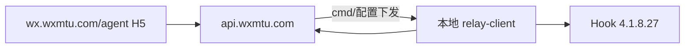

# 萌兔总代后台 H5 — 深度分析（基于本地归档）

**入口：** [https://wx.wxmtu.com/agent](https://wx.wxmtu.com/agent)  
**归档目录：** `reference/mtrobot-agent-portal/`  
**更新：** 2026-06-25  

---

## 1. 关于「全部页面代码」

萌兔后台是 **Vue 2 + Vant UI** 的 **单页应用（SPA）**，生产环境只有：

| 文件 | 大小 | 说明 |
|------|------|------|
| `static/js/app.d31f1d00.js` | ~953 KB | **全部页面/组件/路由/API 封装** 打包在此 |
| `static/css/app.eb257a52.css` | ~308 KB | Vant + 全局样式 |
| `static/img/*` | 31 张 | 界面图片 |
| `static/agent/index.html` | 760 B | 壳 HTML |
| `static/static/config.js` | 164 B | API 基址 `https://api.wxmtu.com/` |

**不存在** 每个页面单独的 `.vue` / `.html` 源文件；「全部代码」= 上述 bundle + 从 JS 反提取的路由/API 清单（见 `manifest.json`）。

---

## 2. 前端技术栈

- **框架：** Vue 2 + vue-router + vuex
- **UI：** Vant（移动端 H5）
- **HTTP：** axios 封装 `du()`，默认 **POST JSON**
- **请求头：** `Authorization: Bearer {token}`、`token`、`uid`、`from: vh5`
- **登录态存储：** `localStorage.token` / `localStorage.uid` / `localStorage.isAgent`

### 总代登录（从 bundle 确认）

```javascript
// window.g.site + 'api' → 实际基址 https://api.wxmtu.com/api/
// POST https://api.wxmtu.com/api/Agent/login
{ username: "88888", password: "******" }
// 成功: status===1, data.token, data.uid → 跳转 /agent-center
```

---

## 3. 页面路由地图（49 条）

### 3.1 总代 / 代理中心

| 路由 | 功能推断 |
|------|----------|
| `/agent` | 总代登录页 |
| `/agent-center` | 代理中心首页 |
| `/agent-center-account` | 账号总览 |
| `/agent-center-account-pc` | **PC 微信端** 账号管理 |
| `/agent-center-account-ipad` | **iPad 协议端** 账号 |
| `/agent-center-account-mac` | **Mac 端** 账号 |
| `/agent-center-account-proxy` | **代理 IP** 配置 |
| `/agent-center-group` | 代理下群列表 |
| `/agent-center-sever` | 服务器/实例管理 |
| `/agent-buy` | 购买套餐 |
| `/agent-template` | 模板管理 |
| `/agent-qr-code` | 二维码 |
| `/agent-model-list` | 模型/套餐列表 |
| `/agent-list-:op` | 代理列表子页（动态 op） |
| `/agent-src-:op` | 代理素材/配置源 |
| `/agent-group` / `/agent-group-:id` | 群管理 |

### 3.2 激活码 / 产品

| 路由 | 功能推断 |
|------|----------|
| `/agent-codes-list` | 激活码列表 |
| `/agent-codes-entry` | 码入库 |
| `/agent-codes-setting` | 码设置 |
| `/agent-codes-asetting` | 高级码设置 |
| `/agent-codes-product` | 码关联产品 |
| `/agent-codes-block` | 码黑名单 |
| `/codes-center` | 码中心 |

### 3.3 群空间 / 娱乐

| 路由 | 功能推断 |
|------|----------|
| `/group-center` | 群空间中心 |
| `/group-arcade-:groupId` | **群娱乐/街机配置**（核心玩法页） |
| `/group-list-:op` | 群数据列表（积分/金币/签到等） |
| `/group-display-:id` | 群展示配置 |
| `/group-resur-:id` | 群资源 |
| `/group-src-:op` | 群素材/指令源 |
| `/group-help` | 群帮助 |

### 3.4 成员 / 用户

| 路由 | 功能推断 |
|------|----------|
| `/member-center` | 成员中心 |
| `/member-center-group` | 成员-群 |
| `/member-center-account` | 成员账号 |
| `/member-addGroup` | 加群 |
| `/member-group` | 成员群管理 |

### 3.5 其他

| 路由 | 功能推断 |
|------|----------|
| `/auth-center` | 授权中心 |
| `/feedbook-center` | 反馈 |
| `/help-center` | 帮助 |
| `/analysis` | 数据分析 |
| `/baby` / `/spirit` / `/immortal` | 超级宝贝/精灵等玩法配置 |
| `/display` | 展示页 |
| `/emoji-copy-:user_id` | 表情复制 |
| `/pay-:str` | 支付相关 |

---

## 4. 后端 API 模块（170+ 路径）

完整列表见 `api-paths.txt`。按模块归纳：

| 模块 | 代表接口 | 职责 |
|------|----------|------|
| **Agent** | login, menus, index, srcGet/srcPost | 总代登录、菜单、首页、配置 |
| **user.pc / user.auth / user.mac / user.proxy** | add, check, setProxy, servers… | **多端运行账号 + IP 代理** |
| **sever** | index, open, close, restart, link… | **服务器/实例** 生命周期 |
| **Group** | get, selectGroup, setOpenStatus, quitGroup | 群开关、选群、退群 |
| **GroupCenter** | get, getGroupMenu, analysis, setSync | **群空间** 数据与菜单 |
| **GroupCenterSrc** | getList, post, postListButton, srcPost… | **群素材/按钮/指令源** 配置 |
| **Arcade** | getTabs, getList | **街机/娱乐模块** 列表 |
| **SuperBaby** | getList, spirit, wish | 超级宝贝玩法 |
| **Product / Codes / Order / Buy** | getList, create, checkOrder… | **产品、激活码、订单、购买** |
| **Template** | getList, switch, del | 模板 |
| **Member** | menu, ipad, unBind | 成员与 iPad 端 |
| **Login / Account** | loginGroup, captcha, loginStatus | 群登录、验证码、状态 |

---

## 5. 与 wechathook 目标架构对照



| 萌兔模块 | wechathook 对应规划 |
|----------|---------------------|
| `user.pc` + `user.proxy` | relay-client + 代理配置 |
| `GroupCenter` + `GroupCenterSrc` | 群配置 + 指令/素材 CMS |
| `Arcade` + `SuperBaby` | 云端 bot-server 玩法插件 |
| `Product/Codes/Order` | SaaS 计费（不必自研时可参考） |
| H5 总代 | 未来 Web 管理台 |

---

## 6. 登录态 API 采样说明

脚本 `scripts/download-mtrobot-agent-portal.js` 在 Phase 2 尝试登录时，若返回：

```json
{"message":"error is exist","code":0,"data":""}
```

常见原因：**同账号已在浏览器在线**，服务端拒绝重复登录。

**处理方式（不修改后台配置）：**

1. 在浏览器打开 [代理后台](https://wx.wxmtu.com/agent) → **退出登录**
2. 重新运行脚本；或
3. 在浏览器 DevTools → Application → localStorage 复制 `token` 和 `uid`，然后：

```powershell
$env:MTROBOT_AGENT_TOKEN="粘贴token"
$env:MTROBOT_AGENT_UID="粘贴uid"
node scripts/download-mtrobot-agent-portal.js
```

脚本 **仅调用读接口**（menus、index、getList 等），不会 POST 修改群/产品/码。

---

## 7. 归档文件清单

```
reference/mtrobot-agent-portal/
├── README.md
├── ANALYSIS.md          ← 本文件
├── manifest.json        ← 路由/API/统计
├── routes.txt
├── api-paths.txt
├── download-log.json
├── static/
│   ├── agent/index.html
│   ├── js/app.d31f1d00.js
│   ├── css/app.eb257a52.css
│   ├── static/config.js
│   └── img/             ← 31 张
└── api-samples/         ← 登录成功后生成
    ├── login-result.json
    └── read-only-samples.json
```

**当前：** 37 个静态文件，合计 ~2.0 MB。

---

**文档版本：** 1.0
