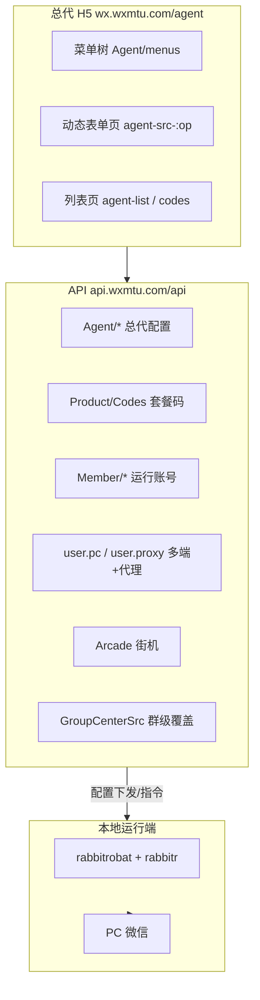

# 萌兔总代后台 — 全量功能分析报告

**同步时间：** 2026-06-25  
**数据来源：** `api-samples/full-sync/`（只读拉取，未修改后台）  
**同步统计：** 95 成功 / 1 失败（`SuperBaby/getList`）

---

## 1. 总体架构



**核心发现：** 萌兔后台不是「每个功能一个独立服务」，而是 **统一动态表单引擎 + 107 个插件 ID + 77 个配置页（op）**。

---

## 2. 配置模型（wechathook 应对齐的数据结构）

### 2.1 总代默认配置

```
POST /api/Agent/srcGet  { "op": "sign" | "boxes" | "fish" | ... }
POST /api/Agent/srcPost { "op": "...", "data": "{...form JSON...}" }  ← 仅后台保存时用，同步脚本未调用
```

响应结构：

```json
{
  "status": 1,
  "data": {
    "title": "签到设置",
    "comment": "群内发送「签到」",
    "notice": "",
    "form": [
      { "type": "switch", "name": "switch_checked", "label": "功能开关", "value": true },
      { "type": "input", "name": "sign_content", "label": "签到关键词", "value": "签到" },
      { "type": "textarea", "name": "message", "label": "签到回复语", "tag": { "金币": "[金币]", ... } }
    ]
  }
}
```

**规律：**

| 字段 | 含义 |
|------|------|
| `switch_checked` | 功能总开关（几乎所有玩法都有） |
| `message` / `*_content` | 触发词或回复模板 |
| `tag` | 模板变量（昵称、金币、钻石、连续签到等） |
| `type: checkbox name: plug` | 仅在 `asetting` — **全局插件开关** |

### 2.2 群级覆盖（未在本次账号拉取 — 需选群后）

```
POST /api/GroupCenterSrc/srcGet  { "group_id", "op", "op_id" }
```

总代配置是 **默认模板**；绑定群后可被群空间配置覆盖。

### 2.3 列表型页面

`/agent-list-customer` → `GroupCenterSrc/srcListFrom` + 表格 CRUD（客服列表）

---

## 3. 插件全量目录（107 个 ID）

完整清单见 [`plugin-catalog.json`](../plugin-catalog.json)。按业务域归纳：

### 3.1 基础 / 群管（总代「基本配置」菜单）

| op / id | 中文 | 配置页 |
|---------|------|--------|
| `asetting` | 默认插件/激活码类型 | ✓ |
| `sign` | 签到 | ✓ |
| `tube` | 护群管理 | ✓ |
| `reply` | 关键词回复 | ✓ |
| `menu` | 菜单设置（三列/自定义） | ✓ |
| `srclimit` | 插件限制 | ✓ |
| `invita` / `active` | 邀请/活跃统计 | ✓ |
| `rename` | 改名提醒 | ✓ |
| `ratelimit` | 消息限制 | ✓ |
| `backlist` | 黑名单 | ✓ |
| `sensitive` | 风险词 | ✓ |
| `drop` / `exphint` | 自动退群/到期提示 | ✓ |
| `bot_name` | 召唤词 | ✓ |
| `friend` / `robotinto` | 好友验证/自动进群 | ✓ |
| `service` / `call` | 联系/召唤客服 | ✓ |
| `welcome` / `outmessage` | 欢迎/退群语 | ✓ |
| `welfare` / `risk` | 主人奖励/风险防控 | ✓ |

### 3.2 经济 / 抽奖 / 盲盒

| id | 中文 | op 配置页 |
|----|------|-----------|
| `boxes` | 拆盲盒 | boxes |
| `egg` | 砸金蛋 | egg |
| `reward` | 抽奖 | reward |
| `baoxiang` | 开宝箱 | baoxiang |
| `shop` | 商城 | （在 plug 内，无独立 op 或合并） |
| `noble` / `head` | 贵族头衔 | noble |
| `liwu` / `present` | 礼物/贵族礼物 | liwu, present |

### 3.3 猜题 / 小游戏

| id | 中文 | op |
|----|------|-----|
| `guesstupian` | 猜图片 | guesstupian |
| `guessphrase` | 猜成语 | guessphrase |
| `guessmusic` | 猜歌名 | guessmusic |
| `guesswangzhe` / `guesshero` | 猜王者/英雄 | guesswangzhe, guesshero |
| `guessnumber` / `guessfirst` | 猜数字/抢答 | guessnumber, guessfirst |
| `zhaocha` | 找茬 | zhaocha |
| `chengyujielong` / `idiom` | 成语接龙/疯狂成语 | chengyujielong, idiom |
| `riddle` / `question` | 猜灯谜/巧思妙答 | riddle, question |
| `gobang` | 五子棋 | gobang |
| `arcade` | 街机游戏 | （Arcade API + plug） |

### 3.4 社交 RPG

| id | 中文 | op |
|----|------|-----|
| `partner` + 子 id | 结婚/宝宝/约会/逼婚/抢婚/洞房 | partner |
| `harem` | 后宫/纳妾 | harem |
| `menpai` | 门派 | menpai |
| `baishi` | 拜师 | baishi |
| `nuli` | 收小弟 | nuli |
| `crony` | 好友 | crony |
| `dajie` / `dajie_despoil` | 打劫/劫色 | dajie |
| `chuanye` | 创业 | chuanye |
| `dsmh_dashang` / `dsmh_smear` | 打赏/抹黑 | dsmh |
| `baby` | 超级宝宝 | baby |
| `farms` | 超级农场 | farms |
| `fish_fishes` / `fish_ground` | 超级钓鱼/渔场 | fish |
| `spirit` | 精灵大陆 | spirit |
| `treasure` | 夺宝大战 | treasure |
| `flaunt` | 炫富 | flaunt |

### 3.5 轻娱乐 / 内容 API

| id | 中文 |
|----|------|
| `song` | 点歌 |
| `weather` / `news` / `fanyi` | 天气/新闻/翻译 |
| `renpin` / `peidui` / `xingzuo` | 人品/配对/星座 |
| `qiucaishen` | 求财神 |
| `qian` | 抽签 |
| `sentence` / `power` / `tgrj` / `cpdd` / `greentea` / `lowlove` | 一言/正能量/舔狗日记等 |
| `son` / `son_more` | 智能聊天/趣味语音 |
| `analysis` | 视频解析 |
| `tarot` / `cp` / `answer` | 塔罗/缘分/答案之书 |

### 3.6 统计 / 工具

| id | 中文 |
|----|------|
| `leaderboard` | 排行榜 |
| `accounts` | 记账簿 |
| `mycard` | 名片 |
| `search` + `links_*` / `search_*` | 查询/王者战力/出装等 |
| `clock` / `timereply` | 定时提醒/定时发言 |
| `fch` | 防撤回 |
| `xiaoheiwu` | 小黑屋 |

---

## 4. 商业与套餐层

`Product/getList` 返回套餐（月卡/年卡/终生版等），每个套餐含：

- `srclimit` — 各玩法 **次数/频率限制**（PHP serialized array）
- `asetting.plug` — 该套餐 **开放哪些插件 ID**
- `admin_num` / `re_group` — 管理群数/续群数

激活码：`Codes/getList`（当前账号 9 条码记录，3 种产品）。

---

## 5. 运行端与代理层

| API | 内容 |
|-----|------|
| `Member/index` | 绑定的微信运行账号列表（当前 ~27 个 wxid） |
| `user.pc/index` | PC 协议端实例 |
| `user.auth/index` | iPad/Auth 端 |
| `user.mac/index` | Mac 端 |
| `user.proxy/index` | **IP 代理池**（节点、套餐、钱包） |
| `sever/index` | 服务器/实例管理 |

**结论：** 萌兔的「代理体系」= 总代 → 运行账号 → 可选 IP 代理 → 本地 rabbitr 执行；与 wechathook 规划的 relay-client 一一对应。

---

## 6. 街机 / 超级宝贝

| API | 结果 |
|-----|------|
| `Arcade/getTabs` | FC / SFC / 街机 / GBA / H5 / MD |
| `Arcade/getList` | 当前列表为空 |
| `SuperBaby/getList` | 失败（可能未开通或无数据） |

---

## 7. 与群指令菜单 / 如家的对照

| 来源 | 覆盖 |
|------|------|
| `群指令菜单.txt` | ≈ 萌兔 `menu` op + `plug` 子集 |
| 如家 `小型游戏` + `打劫闷砖` + `婚姻模块` | ≈ 猜题 op + dajie/partner/menpai op |
| wechathook 现有 | 仅 sign/welcome/checkin/admin |

**萌兔多出来的：** 云端动态表单、107 插件 ID、套餐 srclimit、代理 IP、街机、群空间二级配置。

---

## 8. wechathook 实施建议（基于全量同步）

### 8.1 云端 bot-server 应对齐的模块

| 萌兔模块 | wechathook 包/服务 |
|----------|-------------------|
| `Agent/srcGet` 77 op | `packages/plugin-config` + JSON Schema 按 op |
| `plug` 107 id | `packages/plugins/*` 或 registry manifest |
| `Product/Codes` | `apps/billing`（可选后期） |
| `Member + user.*` | `apps/relay-client` 设备注册 |
| `user.proxy` | relay 代理配置 |
| `GroupCenterSrc` | 群级 `config/groups/*.yaml` 或 DB |
| `Arcade` | 独立 arcade 插件包 |

### 8.2 建议实施波次

**波次 1（基础设施）：** 动态配置模型 `switch_checked + message + tags`；`sign` / `menu` / `welcome`  
**波次 2（猜题引擎）：** 合并 12+ guess* op 为一个 engine + 题库  
**波次 3（经济）：** 金币/钻石/排行榜（sign 模板变量已定义）  
**波次 4（重玩法）：** fish / farms / partner / boxes  
**波次 5（SaaS）：** Product/Codes/代理 IP

### 8.3 本地文件索引

```
reference/mtrobot-agent-portal/
├── plugin-catalog.json          # 107 插件 + 77 配置页字段摘要
├── api-samples/full-sync/
│   ├── Agent/srcGet/{op}.json   # 77 个功能完整表单默认值
│   ├── Agent/srcList/customer.json
│   ├── platform/*.json          # 套餐/账号/代理/街机
│   └── _meta/sync-summary.json
└── FULL-ANALYSIS.md             # 本文件
```

重新同步：

```powershell
$env:MTROBOT_AGENT_USER="88888"
$env:MTROBOT_AGENT_PASS="***"
node scripts/sync-mtrobot-agent-full.js
node scripts/extract-mtrobot-catalog.js
```

---

## 9. 安全提醒

- `full-sync/platform/` 含 **运行账号、代理 JWT、手机号** 等敏感信息，**勿提交公开 Git**。
- 同步脚本 **仅调用 srcGet/getList**，未调用 srcPost，**未修改后台任何配置**。

---

**文档版本：** 1.0（全量只读同步 95/96 接口）
